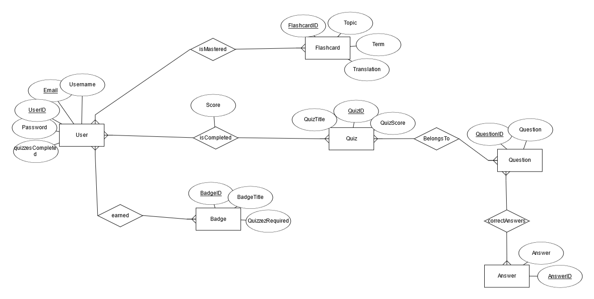
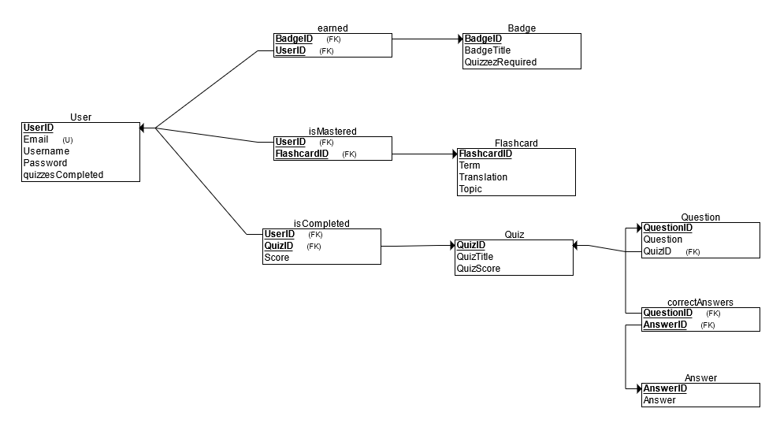

<h2>ICT engineering project: QuadLingo </h2>

****
<h3>Project Description</h3>

****
**Quadlingo** is a fullstack app for learning languages. It is programmed using Java, JavaFX and CSS.

The app is designed to help English, French, Chinese and Arabian speakers learn the basics of Finnish. The app has a variety of features such as: user profile and progress, flashcards, quizzes and achievements.
With the help of these features, the user can learn Finnish in a fun and interactive way.

****

<h3>Technology utilized</h3>

****

For coding the projects Frontend and Backend we used Java, JavaFX and CSS. The whole project was made using IntelliJ IDEA.
Since the project is a group project, we used GitHub for version control and Trello for project management. The prototype was made on Figma.
We also used Google Docs for project Sprint documentation and Google Sheets for tracking work hours.

Artificial intelligence was used for writing the questions and answers for the quizzes. For writing the code of some of the functionalities in this project, we used ChatGpt and Copilot.

****

<h3>Installation</h3>

****
1. Download an environment for database handling unless you already have one. We recommend using HeidiSQL for Windows, DataGrip for Mac and Linux.
    - [HeidiSQL (Windows)](https://www.heidisql.com/download.php?download=installer)
    - [DataGrip (Windows, Mac, Linux)](https://www.jetbrains.com/datagrip/features/?source=google&medium=cpc&campaign=EMEA_en_WEST_DataGrip_Search_RLSA&term=sql%20database&content=555193249366&gad_source=1&gclid=Cj0KCQiA88a5BhDPARIsAFj595hZXkn2YbwaTcrq-f8E_5OuTMKJviU8mQVWBeXH3rUCOKaPguWJ5nUaAnzhEALw_wcB)

2. Set up a database for the project. The script is available in directory `DatabaseCreation` in the root of the project.

3. Download and install IntelliJ IDEA.
    - [IntelliJ IDEA (Windows)](https://www.jetbrains.com/idea/download/?section=windows)
    - [IntelliJ IDEA (Mac)](https://www.jetbrains.com/idea/download/?section=mac)
    - [IntelliJ IDEA (Linux)](https://www.jetbrains.com/idea/download/?section=linux)

4. Create a new Java project in IntelliJ IDEA. Use Maven as build system.

5. Clone Quadlingo from GitHub.
   ```bash
   git clone https://github.com/aliisaro/QuadLingo-Group-project.git
   ```
   
6. Run the class Main.java in the package `Main` to start the application.

7. Enjoy!

****

<h3>Usage</h3>

****
1. Choose your language.
2. Register a new user if you don't have one.
3. Log in with the new user.
4. Start learning Finnish by practicing with flashcards and doing quizzes.
5. Check your progress and achievements.
6. Log out when you are done.

****

<h3>Links:</h3>

****

- [Trello](https://trello.com/b/0ghzAMVd/sep1r3quadlingo)
- [Figma](https://www.figma.com/board/Zf2zcEdCqcuYQXKmy4bkty/QuadLingo-Prototype?node-id=0-1&node-type=CANVAS&t=XiQJ9bqYCNB3P3xh-0)
- [Project plan](https://docs.google.com/document/d/1-s1jKAn0swS53RCD-dMNoprozXF89F-k9JRBz1wD6L0/edit)
- [Work hours](https://docs.google.com/spreadsheets/d/10PlqGo4965hiHXeSnTN6XlKYykul5-xdi_aEbyekmFA/edit?gid=0#gid=0)

****
<h3>Database design</h3>






